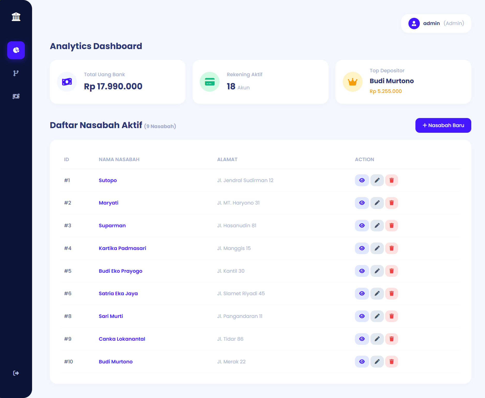
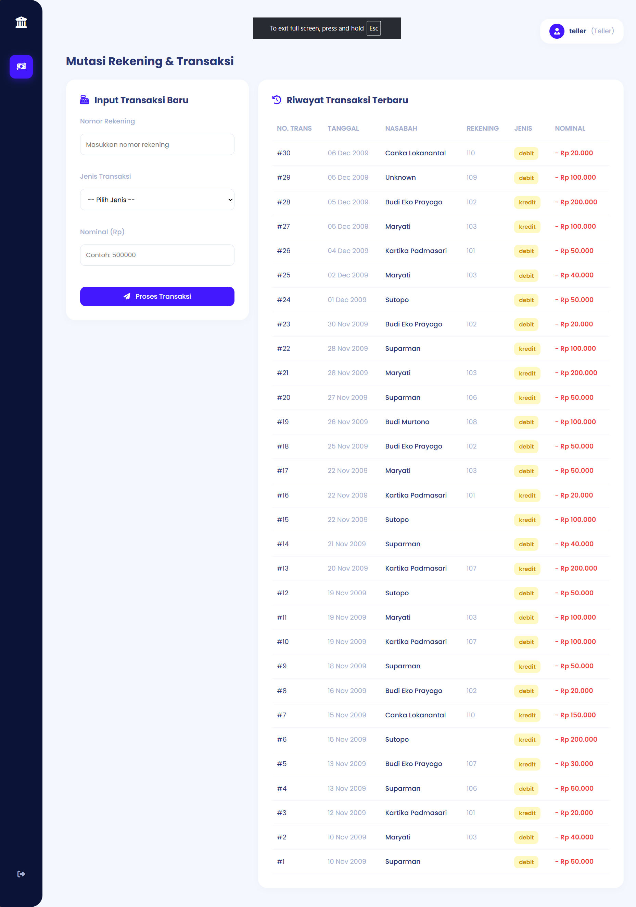
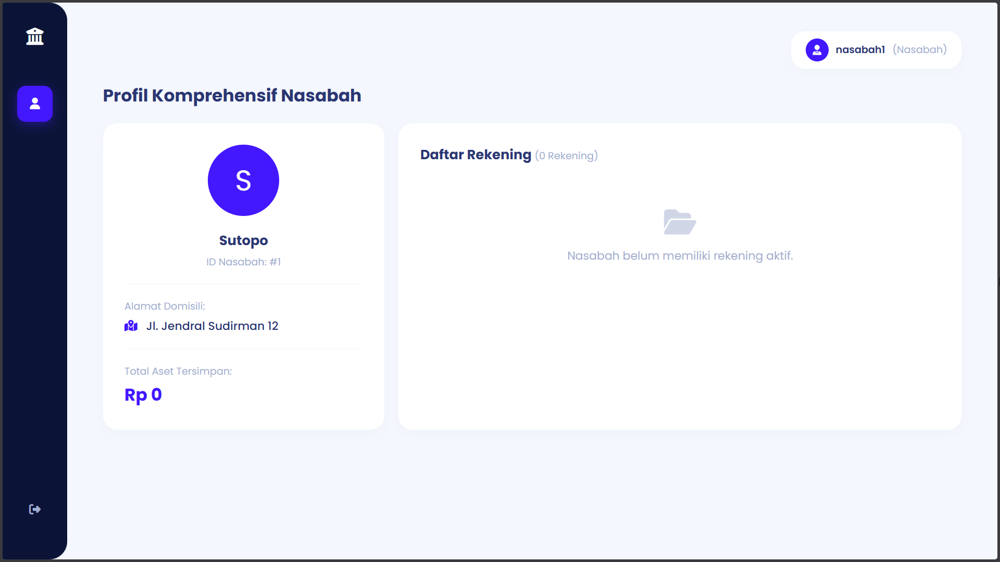

# 🏦 Sistem Informasi Perbankan (Web-Based)


Sebuah aplikasi web manajemen perbankan terintegrasi yang dibangun menggunakan **PHP Native** dan **PostgreSQL**. Proyek ini dikembangkan sebagai sistem manajemen operasional perbankan yang berfokus pada eksekusi DDL, DML, operasi `JOIN` kompleks, dan implementasi keamanan menggunakan *Role-Based Access Control* (RBAC).

Aplikasi ini menggunakan pendekatan arsitektur modular untuk memisahkan logika *backend* (*actions*) dengan tampilan visual antarmuka (*includes/UI*).

---

## 📸 Cuplikan Layar (Screenshots)

### Admin
> 
> *Tampilan Dashboard Admin*

### Teller
> 
> *Tampilan Dashboard Teller*

### Nasabah
> 
> *Tampilan Dashboard Nasabah*

---

## 🚀 Modul & Fitur Utama

Sistem ini terbagi ke dalam beberapa modul fungsional yang mensimulasikan operasional bank di dunia nyata:

#### 📊 Analytics & Dashboard
- Perhitungan *real-time* jumlah total nasabah aktif.
- Agregasi finansial: Total uang yang beredar di bank (`SUM(saldo)`).
- Analitik data: Menampilkan nasabah dengan saldo tertinggi (*Top Depositor*).

#### 👥 Modul Manajemen Nasabah (CRUD)
- Pendaftaran identitas nasabah baru.
- Pembaruan dan penghapusan data secara dinamis.
- Halaman **Profil Komprehensif**: Menampilkan detail nasabah beserta seluruh rekening yang dimilikinya (memanfaatkan kueri `JOIN` antar tabel).

#### 💰 Modul Transaksi & Mutasi
- Pencatatan aktivitas finansial (Setor, Tarik, Transfer).
- Pembaruan saldo rekening secara otomatis ketika transaksi baru diinput.
- Tabel riwayat transaksi dengan *timestamp*.

#### 🏢 Modul Informasi Cabang
- Menampilkan direktori operasional dan lokasi masing-masing kantor cabang bank dengan antarmuka UI bergaya *Card Grid*.

#### 🔐 Keamanan & RBAC (Role-Based Access Control)
Sistem diatur menggunakan otentikasi hak akses bertingkat:
- **Admin:** Memiliki kontrol penuh atas seluruh modul dan entitas data (Nasabah, Rekening, Transaksi).
- **Teller:** Hanya diberikan hak akses untuk melakukan *input* transaksi finansial dan melihat riwayat mutasi.
- **Nasabah:** Akses *read-only* (hanya baca) untuk melihat dasbor profil dan mutasi saldo pribadi mereka.

---

## 🗄️ Skema Database (Entity Relationship)

Aplikasi ini berjalan di atas struktur database relasional dengan 5 tabel utama dan tabel Users untuk otentikasi:
- `nasabah` : Menyimpan identitas dasar (ID, Nama Lengkap, Alamat).
- `cabang_bank` : Menyimpan data informasi cabang operasional.
- `rekening` : Menyimpan nomor rekening, saldo, dan terhubung dengan cabang tempat rekening dibuka.
- `transaksi` : Mencatat riwayat finansial (jenis transaksi, nominal, waktu) yang berelasi dengan rekening.
- `nasabah_has_rekening` : Tabel *junction/pivot* yang menjembatani relasi *Many-to-Many* (M:N) antara nasabah dan rekening (memungkinkan satu nasabah memiliki banyak rekening, dan akun *joint*).
- `users` : Menyimpan autentikasi akun berdasarkan *role*.

---

## 📂 Struktur Direktori Proyek

```struktur_direktori
Perbankan/
├── actions/                  # Murni logika PHP (Pemrosesan Data & Validasi)
│   ├── hapus_data.php        
│   ├── logout.php            # Aksi terminasi session
│   ├── proses_login.php      # Validasi form autentikasi login
│   ├── proses_transaksi.php  # Eksekutor perubahan saldo rekening & riwayat mutasi
│   ├── simpan_data.php       
│   └── update_data.php       
├── assets/                   # Aset Statis  
│   └── img/                  # Gambar        
├── config/                   # Konfigurasi Inti
│   └── koneksi.php           # Konektor PDO ke database PostgreSQL
├── includes/                 # Komponen UI Reusable
│   ├── header.php            # <head>, CSS Styling, RBAC checks, dan Sidebar Navbar
│   └── footer.php            # Penutup tag HTML
├── tools/                    # Skrip Utilitas (Tidak diakses user)
│   ├── create_users.php      # Skrip generate akun default & tabel `users`
│   └── list_tables.php       # Skrip pengecekan koneksi & tabel DB
├── cabang.php                # Halaman Direktori Cabang
├── edit.php                  # Halaman Form Update Nasabah
├── index.php                 # Halaman Dashboard Utama
├── login.php                 # Halaman Form UI Login
├── profil.php                # Halaman Detail Profil (JOIN queries)
├── tambah.php                # Halaman Form Input Nasabah
└── transaksi.php             # Halaman Antarmuka Mutasi Rekening & Log
```

## ⚙️ Panduan Instalasi & Setup
### Prasyarat Lingkungan
- XAMPP v3.3+ (PHP 8.0 atau lebih baru)
- pgAdmin 4 & Server PostgreSQL 14+

### 1. Kloning & Konfigurasi Server
1. Letakkan folder Perbankan ke dalam direktori lokal server Anda (C:\xampp\htdocs\Perbankan).
2. Buka XAMPP Control Panel > Config (pada Apache) > PHP (php.ini).
3. Cari dan hilangkan tanda titik koma (;) pada baris extension=pdo_pgsql dan extension=pgsql.
4. Simpan file tersebut lalu Restart modul Apache.

### 2. Setup Database & Import Data Dummy
Sistem ini membutuhkan data awal agar dasbor dapat berfungsi penuh. Ikuti langkah berikut untuk memasukkan data melalui pgAdmin 4:
1. Buka pgAdmin 4 dan buat database baru dengan nama perbankan.
2. Klik kanan pada database perbankan dan pilih Query Tool.
3. Pastikan Anda telah membuat struktur tabel (DDL) terlebih dahulu.
4. Copy kode SQL di bawah ini dan Paste ke dalam Query Tool:

```sql
-- Insert Data Cabang Bank
INSERT INTO cabang_bank (kode_cabang, nama_cabang, alamat_cabang) VALUES
('BRUS', 'Bank Rut Unit Surakarta', 'Jl. Slamet Riyadi 18'),
('BRUM', 'Bank Rut Unit Magelang', 'Jl. P. Tendean 63'),
('BRUB', 'Bank Rut Unit Boyolali', 'Jl. Ahmad Yani 45'),
('BRUK', 'Bank Rut Unit Klaten', 'Jl. Suparman 23'),
('BRUY', 'Bank Rut Unit Yogyakarta', 'Jl. Anggrek 21'),
('BRUW', 'Bank Rut Unit Wonogiri', 'Jl. Untung Suropati 12');

-- Insert Data Nasabah
INSERT INTO nasabah (id_nasabah, nama_nasabah, alamat_nasabah) VALUES
(1, 'Sutopo', 'Jl. Jendral Sudirman 12'),
(2, 'Maryati', 'Jl. MT. Haryono 31'),
(3, 'Suparman', 'Jl. Hasanudin 81'),
(4, 'Kartika Padmasari', 'Jl. Manggis 15'),
(5, 'Budi Eko Prayogo', 'Jl. Kantil 30'),
(6, 'Satria Eka Jaya', 'Jl. Slamet Riyadi 45'),
(7, 'Indri Hapsari', 'Jl. Sutoyo 5'),
(8, 'Sari Murti', 'Jl. Pangandaran 11'),
(9, 'Canka Lokananta', 'Jl. Tidar 86'),
(10, 'Budi Murtono', 'Jl. Merak 22');

-- Insert Data Rekening
INSERT INTO rekening (no_rekening, kode_cabang, pin, saldo) VALUES
(101, 'BRUS', '1111', 500000),
(102, 'BRUS', '2222', 350000),
(103, 'BRUS', '3333', 750000),
(104, 'BRUM', '4444', 900000),
(105, 'BRUM', '5555', 2000000),
(106, 'BRUS', '6666', 3000000),
(107, 'BRUS', '7777', 1000000),
(108, 'BRUB', '0000', 5000000),
(109, 'BRUB', '9999', 0),
(110, 'BRUY', '1234', 550000),
(111, 'BRUK', '4321', 150000),
(112, 'BRUK', '0123', 300000),
(113, 'BRUY', '8888', 255000);

-- Insert Data Relasi Nasabah & Rekening
INSERT INTO nasabah_has_rekening (id_nasabah, no_rekening) VALUES
(1, 104), (2, 103), (3, 105), (3, 106), (4, 101), (4, 107), 
(5, 102), (5, 107), (6, 109), (7, 109), (8, 111), (9, 110), 
(10, 113), (8, 112), (10, 108);

-- Insert Data Transaksi
INSERT INTO transaksi (no_trans, no_rekening, id_nasabah, jenis_transaksi, tanggal, jumlah) VALUES
(1, 105, 3, 'debit', '2009-11-10', 50000),
(2, 103, 2, 'debit', '2009-11-10', 40000),
(3, 101, 4, 'kredit', '2009-11-12', 20000),
(4, 106, 3, 'debit', '2009-11-13', 50000),
(5, 107, 5, 'kredit', '2009-11-13', 30000),
(6, 104, 1, 'kredit', '2009-11-15', 200000),
(7, 110, 9, 'kredit', '2009-11-15', 150000),
(8, 102, 5, 'debit', '2009-11-16', 20000),
(9, 105, 3, 'kredit', '2009-11-18', 50000),
(10, 107, 4, 'debit', '2009-11-19', 100000),
(11, 103, 2, 'debit', '2009-11-19', 100000),
(12, 104, 1, 'debit', '2009-11-19', 50000),
(13, 107, 4, 'kredit', '2009-11-20', 200000),
(14, 105, 3, 'debit', '2009-11-21', 40000),
(15, 104, 1, 'kredit', '2009-11-22', 100000),
(16, 101, 4, 'kredit', '2009-11-22', 20000),
(17, 103, 2, 'debit', '2009-11-22', 50000),
(18, 102, 5, 'debit', '2009-11-25', 50000),
(19, 108, 10, 'debit', '2009-11-26', 100000),
(20, 106, 3, 'kredit', '2009-11-27', 50000),
(21, 103, 2, 'kredit', '2009-11-28', 200000),
(22, 105, 3, 'kredit', '2009-11-28', 100000),
(23, 102, 5, 'debit', '2009-11-30', 20000),
(24, 104, 1, 'debit', '2009-12-1', 50000),
(25, 103, 2, 'debit', '2009-12-2', 40000),
(26, 101, 4, 'debit', '2009-12-4', 50000),
(27, 103, 2, 'kredit', '2009-12-5', 100000),
(28, 102, 5, 'kredit', '2009-12-5', 200000),
(29, 109, 7, 'debit', '2009-12-5', 100000),
(30, 110, 9, 'debit', '2009-12-6', 20000);

```
5. Tekan tombol Execute/Refresh (F5).
6. Panel Messages akan menampilkan status keberhasilan eksekusi query.

## Konfigurasi Aplikasi & Menjalankan Web
1. Buka file config/koneksi.php.
2. Sesuaikan nilai variabel $password dengan kata sandi PostgreSQL Anda.
3. Buka peramban (browser) dan jalankan skrip seeder otentikasi satu kali di 
    `http://localhost:82/perbankan/tools/create_users.php` (Sesuaikan port jika perlu).

4. Setelah sukses, buka halaman utama aplikasi di:
    `http://localhost:82/perbankan/login.phpAkun` 
    
### Simulasi Login
| Username | Password | Hak Akses |
| --- | --- | --- |
| admin | 123456 | Admin |
| teller | 123456 | Teller |
| nasabah1 | 123456 | Nasabah |
`

## 🛠️ Pemecahan Masalah (Troubleshooting)
**Error**: `could not find driver saat memuat halaman web`
Ini terjadi karena Apache di Windows gagal memuat library PostgreSQL secara otomatis.

**Solusi:** 
1. Masuk ke direktori instalasi PHP (C:\xampp\php\).
2. Cari dan copy file bernama libpq.dll.
3. Paste file tersebut ke dalam folder mesin Apache (C:\xampp\apache\bin\).
4. Restart modul Apache di XAMPP Control Panel.


`Proyek ini merupakan demonstrasi fungsional pengembangan perangkat lunak web dan rekayasa basis data relasional.`

